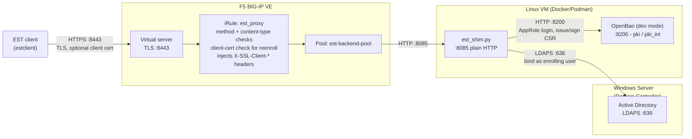

# Deploying est-proxy-bigip with Active Directory (F5 UDF)

A complete walkthrough for a new engineer deploying this project in an F5
UDF blueprint (BIG-IP + AD + a client VM) — including standing up OpenBao
yourself, since UDF doesn't provide one.

## What you're building



Three systems, three separate jobs — worth keeping straight before you start:

- **BIG-IP** terminates TLS and enforces the EST protocol's rules (which
  HTTP methods and content-types are valid for which operation, and that
  `simplereenroll` requires a client certificate). It doesn't know anything
  about AD or OpenBao — it just proxies to the shim.
- **Active Directory answers "is this a real, authenticated user?"** —
  nothing more. It never sees or issues a certificate.
- **OpenBao answers "here's a signed certificate."** — it doesn't know or
  care about AD; it just signs whatever CSR it's handed once the shim
  decides (based on the AD check) to ask it to.

`est_shim.py` is the glue in the middle: on `simpleenroll`, it checks with
AD first, and only if that succeeds does it forward the CSR to OpenBao.

## Quick concept primer

If any of these are unfamiliar, read this section; if not, skip to Part 0.

- **EST (RFC 7030)** is a protocol for a client (a router, an IoT device,
  anything that needs a certificate) to automatically request one from a CA
  over HTTPS, instead of a human generating a CSR and emailing it around.
  `simpleenroll` is the main operation: client sends a CSR, server sends
  back a signed cert.
- **An LDAP bind** is literally just "attempt to log in." The client sends a
  username and password to the directory server, and the directory server
  either accepts them (the password was correct) or rejects them. That's
  the entire mechanism this project uses for authentication — a successful
  bind *is* the proof of identity, there's no separate password check.
- **LDAPS** is LDAP over TLS (port 636, vs. plain LDAP on 389). Active
  Directory requires a valid certificate installed on the domain controller
  before it will accept LDAPS connections at all — the single most common
  setup snag, covered in Part 1.
- **OpenBao** is an open-source secrets manager (a fork of HashiCorp Vault,
  same API) with a built-in PKI engine — it can act as a certificate
  authority, issuing and signing certificates over a simple HTTP API. This
  project uses its `pki`/`pki_int` secrets engine as the actual CA.
- **A BIG-IP client-ssl profile** is the object that tells a virtual server
  "terminate TLS here, using this certificate, and optionally ask the
  connecting client for a certificate of their own." `peerCertMode: request`
  (used here) means "ask for a client cert, but don't require one" —
  necessary because most EST operations don't need one, but `simplereenroll`
  does.
- **An iRule** is a small script (Tcl) attached to a BIG-IP virtual server
  that runs custom logic on every request — here, it's what makes the VS
  understand EST's URL structure and method rules instead of just blindly
  forwarding traffic.

## Prerequisites

- A UDF deployment with a BIG-IP, a Windows AD/DC VM, and a Linux client VM
  (or any Linux VM you can add) with Docker or Podman.
- Network reachability: BIG-IP → the Linux VM (pool traffic), Linux VM → the
  DC on port 636, and your test client → the BIG-IP VS.
- `git clone https://github.com/jmack707/est-proxy-bigip` on the Linux VM.
- If you're on **Podman** (not Docker), run `sudo loginctl enable-linger
  $(whoami)` on the Linux VM first — rootless Podman containers otherwise
  die the moment your SSH session ends, which is easy to mistake for a
  script bug. `quickstart.sh` (below) checks for this and warns, but it's
  one less thing to hit.

---

## Fast path: one file, one script

Parts 0–3 below (OpenBao, the shim, and the BIG-IP deploy) can be done in
one shot instead of by hand:

```sh
cp deploy.env.example deploy.env   # fill in your BIG-IP/AD/domain details
./quickstart.sh
```

This is validated end-to-end against real infrastructure (a live BIG-IP,
a real directory server) — see the main README's "Quickstart" section for
what it actually does and the bugs that surfaced (and got fixed) building
it. Part 1 (AD/LDAPS setup) still needs to happen on the AD side first
(it's not something a script on the Linux VM can do for you), and Part 4
(testing with `estclient`) is still manual. If you want to understand
*what* the script is doing, or something about your environment doesn't
fit its assumptions, Parts 0–3 below walk through the same steps by hand.

---

## Part 0 — Stand up OpenBao (UDF doesn't provide one)

`est_shim.py` needs a Vault-API-compatible PKI backend — it doesn't care
whether that's a real production Vault cluster or a five-second throwaway
instance. Since UDF gives you no such thing, use **dev-mode OpenBao**: it
runs entirely in memory and starts already unsealed, skipping the
init/unseal ceremony a real deployment would need.

**This is a lab/demo-only choice, not a production one** — nothing survives
a container restart, and the root token is a fixed, known value. Fine for a
UDF blueprint that gets torn down and rebuilt regularly; not fine for
anything meant to persist or be trusted beyond that.

```sh
cd est-proxy-bigip
docker compose up -d openbao
```

Bootstrap its PKI — one script does everything: mounts a root CA, generates
+ signs an intermediate CA, creates a signing role scoped to your domain,
and creates an AppRole for the shim. (Every command in this script was
validated end-to-end against a real OpenBao 2.2.0 instance before being
committed — not copied from docs and assumed correct.)

```sh
BAO_ADDR=http://127.0.0.1:8200 ./bootstrap-openbao-dev.sh example.com
```

It prints output like this — you'll paste it into `est-shim.env` in Part 2:

```
BAO_ADDR=http://127.0.0.1:8200
BAO_ROLE_ID=<generated>
BAO_SECRET_ID=<generated>
PKI_MOUNT=pki_int
PKI_ROLE=example-com
DOMAIN=example.com
```

Grab the CA chain — you'll need it twice: once as `EST_OPENSSL_CACERT` for
`estclient` (Part 4), and once to issue the BIG-IP virtual server's own
certificate (Part 3):

```sh
curl -s http://127.0.0.1:8200/v1/pki_int/ca_chain > ca-chain.pem
```

---

## Part 1 — Active Directory setup

### 1a. Enable LDAPS on your domain controller

AD does **not** listen on 636 by default — it only starts once a valid TLS
certificate is installed in the DC's local machine certificate store. If
your domain already has AD Certificate Services issuing certs to domain
controllers automatically via autoenrollment, you may already have this —
skip to the verification step below.

If not, you need a certificate on the DC with:
- Subject/SAN matching the DC's FQDN (e.g. `dc01.example.com`)
- **Server Authentication** EKU (`1.3.6.1.5.5.7.3.1`)
- Installed into the **Local Computer → Personal** certificate store on the
  DC (not the current-user store)

Once that's present, AD DS picks it up automatically — no service restart
required, but restarting `NTDS` (or the whole box, if you have a
maintenance window) guarantees a clean pickup.

**Verify LDAPS is actually listening**, from any machine that can reach the
DC:

```sh
openssl s_client -connect dc01.example.com:636 -showcerts </dev/null
```

You should see a certificate chain print and the connection succeed (it's
fine if `openssl` reports the cert isn't locally trusted — you're just
confirming the port answers with TLS). If this hangs or refuses, LDAPS
isn't enabled yet and nothing downstream will work — fix this first.

### 1b. Get a test user

You do **not** need to create a special service account. This project's
LDAP check binds to AD using the enrolling client's *own* username and
password — the same credentials authenticate to AD and identify which
certificate is being requested. Any existing AD user account works for
testing:

```powershell
New-ADUser -Name "est-test-user" -SamAccountName "est-test-user" `
  -UserPrincipalName "est-test-user@example.com" `
  -AccountPassword (ConvertTo-SecureString "SomeStrongPassword1!" -AsPlainText -Force) `
  -Enabled $true -PasswordNeverExpires $true
```

(`-PasswordNeverExpires` is just to keep the test account from breaking
mid-demo — don't do that for real accounts.)

Note the exact **UPN** (`est-test-user@example.com`) — that's what you'll
authenticate with.

---

## Part 2 — Deploy the EST backend (`est_shim.py`)

### 2a. Configure

```sh
cp est-shim.env.example est-shim.env
```

Edit `est-shim.env`, combining the OpenBao values from Part 0 with your AD
details:

```sh
BAO_ADDR=http://openbao:8200          # compose service name -- see note below
BAO_ROLE_ID=<from Part 0>
BAO_SECRET_ID=<from Part 0>
PKI_MOUNT=pki_int
PKI_ROLE=example-com
DOMAIN=example.com
LISTEN_PORT=8085

LDAP_ENABLED=true
LDAP_URI=ldaps://dc01.example.com:636
LDAP_BIND_DN_TEMPLATE={username}@example.com
LDAP_START_TLS=false
LDAP_REQUIRE_OPS=simpleenroll
LDAP_ENFORCE_CN_MATCH=true
```

`LDAP_BIND_DN_TEMPLATE={username}@example.com` is the AD-specific line —
this is a **UPN bind**, the simplest way to authenticate against AD (no
need to know the full LDAP distinguished-name syntax). `{username}` gets
substituted with whatever username the EST client sends over HTTP Basic
auth.

**`LDAP_ENFORCE_CN_MATCH=true`** means the CSR's Common Name must exactly
equal the authenticated username (here, the UPN). If your devices will
request certs with a *different* CN than the AD username enrolling them
(e.g. a shared automation account enrolling certs for many device
hostnames), set this to `false`.

**Note on `BAO_ADDR`**: if you run the shim via `docker compose up -d
est-shim` (both containers on the same Docker network), use the compose
service name `http://openbao:8200` — `127.0.0.1` only resolves to itself
from inside a container, not to the OpenBao container. If you instead run
`est_shim.py` directly as a host process (not in a container), use
`http://127.0.0.1:8200`.

### 2b. Run it

```sh
docker compose up -d est-shim
```

Or as a plain host process:
```sh
pip install -r requirements.txt
python3 est_shim.py   # reads its config from the environment, not a file --
                       # export the est-shim.env vars first, or use
                       # `env $(cat est-shim.env | xargs) python3 est_shim.py`
```

### 2c. Sanity-check the LDAP piece before touching BIG-IP at all

This isolates AD problems from BIG-IP problems — much easier to debug one
thing at a time.

```sh
# should fail with 401 (no credentials supplied)
curl -s -X POST http://localhost:8085/.well-known/est/simpleenroll \
  -H "Content-Type: application/pkcs10" --data-binary "" -o /dev/null -w "%{http_code}\n"

# should fail with 403 (wrong password)
curl -s -X POST http://localhost:8085/.well-known/est/simpleenroll \
  -u "est-test-user:wrong-password" \
  -H "Content-Type: application/pkcs10" --data-binary "" -o /dev/null -w "%{http_code}\n"
```

If the second one doesn't return `403`, stop here — it means the shim can't
reach/bind to AD at all (check `docker compose logs est-shim` for the real
LDAP error), and nothing past this point will work either.

---

## Part 3 — Deploy the BIG-IP objects

Run it, pointing `--pool-member` at the Linux VM from Part 2 and
`--vs-destination` at whatever IP:port you want the VS to listen on:

```sh
python3 deploy_bigip.py <bigip-mgmt-host> <admin-user> <admin-password> est_proxy.irule.tcl \
  --pool-member <linux-vm-ip>:8085 --vs-destination <vs-listener-ip>:8443 \
  --vs-vlan /Common/<your-vlan>
```

This creates the pool, a client-ssl profile (`est-clientssl`), the iRule,
and the virtual server. It's safe to re-run — objects that already exist
are reported and skipped, not errored on.

**Give the VS a real certificate** issued by the OpenBao you stood up in
Part 0, with a CN/SAN matching the hostname you'll actually connect to it
with (not F5's stock self-signed `default.crt` — see the main README's
gotcha #4 for exactly why strict EST clients reject that):

```sh
curl -s -X POST -H "X-Vault-Token: root" \
  -d '{"common_name":"<your-vs-hostname>"}' \
  http://127.0.0.1:8200/v1/pki_int/issue/example-com \
  | python3 -c "import sys,json; d=json.load(sys.stdin)['data']; open('vs.crt','w').write(d['certificate']); open('vs.key','w').write(d['private_key'])"
```

Install `vs.crt`/`vs.key` on the client-ssl profile via `tmsh` or the GUI
(see the main README's "Deploying" section for the `tmsh install sys
crypto` walkthrough).

This curl-direct-to-OpenBao step is specifically for the EST proxy VS's
*own* first certificate — a bootstrapping exception, since you can't use
EST through a VS to get that same VS its first certificate. For **any other
BIG-IP** (or to renew this VS's certificate later), once the EST proxy is
up, use `bigip-est-enroll.py` from the repo root instead — it does a real
EST enrollment (via `estclient`) and installs the result via `tmsh`, since
TMOS has no native EST client of its own:

```sh
python3 bigip-est-enroll.py enroll \
  --est-host <vs-hostname> --est-port 8443 --est-cacert ca-chain.pem \
  --common-name <target-bigip-hostname> \
  --bigip-host <target-bigip-mgmt-ip> --bigip-user admin --bigip-pass '...' \
  --cert-name <target-bigip-hostname>-cert --attach-profile est-clientssl \
  --save-dir ./saved
```

See the main README's "Getting a BIG-IP its own certificate via EST"
section for the full walkthrough, including renewal.

---

## Part 4 — Test the whole chain with a real EST client

On Debian/Ubuntu, the real RFC 7030 client is `libest-utils`:

```sh
sudo apt-get install libest-utils
```

```sh
export EST_OPENSSL_CACERT=/path/to/ca-chain.pem   # from Part 0

# 1. cacerts -- no auth needed, just proves TLS + the CA chain are right
estclient -g -s <vs-hostname> -p 8443 -o /tmp/est-out

# 2. simpleenroll -- this is the one that goes through the AD check
estclient -e -s <vs-hostname> -p 8443 -o /tmp/est-out \
  --common-name est-test-user@example.com \
  -u est-test-user -h 'SomeStrongPassword1!'
```

`--common-name` here **must match** the AD username you authenticate with
(`-u`), because of `LDAP_ENFORCE_CN_MATCH=true` from Part 2a. If you get a
`403` mentioning a CN mismatch, this is almost always why.

A successful enrollment writes the signed cert to
`/tmp/est-out/cert-0-0.pkcs7` (it's actually base64 text despite the
filename):

```sh
base64 -d /tmp/est-out/cert-0-0.pkcs7 | openssl pkcs7 -inform DER -print_certs -noout
```

---

## Troubleshooting

| Symptom | Likely cause |
|---|---|
| `openssl s_client` to port 636 hangs/refuses | LDAPS isn't enabled on the DC — see Part 1a |
| Shim can't reach OpenBao at all | `BAO_ADDR` wrong for how you're running the shim — `http://openbao:8200` under compose, `http://127.0.0.1:8200` as a host process (see note in Part 2a) |
| Shim returns `403` for correct AD credentials | Check `LDAP_BIND_DN_TEMPLATE` matches your actual UPN format; check the shim's logs for the real LDAP bind error |
| Shim returns `403` mentioning "does not match" | CSR CN and the authenticated username don't match — either fix `--common-name`, or set `LDAP_ENFORCE_CN_MATCH=false` if that's intentional |
| `estclient` fails with `EST_ERR_FQDN_MISMATCH` | The VS's TLS certificate's CN/SAN doesn't match the `-s` hostname — see main README gotcha #4 |
| `estclient` fails with a TLS/EOF error mid-response | BIG-IP's `unclean-shutdown` client-ssl setting — see main README gotcha #2 |

## Two things worth knowing before you rely on this for anything real

1. **Dev-mode OpenBao is not persistent or secure by design** (Part 0) — a
   container restart loses every issued cert and the whole CA. Fine for a
   UDF lab; migrate to a real Vault/OpenBao deployment (init/unseal, real
   storage backend) before this needs to outlive a demo.
2. **The shim doesn't validate the AD domain controller's LDAPS
   certificate** (`ldap3.Server(..., use_ssl=True)` with no explicit `Tls`/
   CA-validation object configured). It will bind successfully even to an
   LDAPS endpoint presenting an untrusted or spoofed certificate — fine for
   a lab, but a real gap for production, since it opens the door to a
   network-level attacker intercepting the AD bind. The fix is passing an
   explicit `ldap3.Tls(validate=ssl.CERT_REQUIRED, ca_certs_file=...)` into
   the `Server()` call in `est_shim.py`, pointed at your AD CA's cert.
