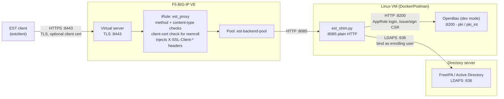

# Architecture

## Context

BIG-IP does not speak EST. RFC 7030 is what a large amount of network gear, IoT, and 802.1X supplicants use to enrol and renew certificates automatically, and TMOS has no native client or server for it: Certificate Order Manager integrates only with specific commercial CA vendor APIs, and BIG-IP 21.1's headline certificate-automation feature was ACMEv2, introduced precisely because no built-in automated enrolment protocol existed before it.

This project makes a virtual server behave like an EST server. It is operated by whoever runs the BIG-IP, and the CA it fronts is a Vault-API-compatible PKI backend — a production Vault cluster or, in a lab, a throwaway OpenBao instance.

Protocol background, including the trust-anchor bootstrap problem and the full operation set, is in [EST protocol notes](est-protocol.md).

## Components

| Component | Runtime | Responsibility |
|---|---|---|
| `est_proxy.irule.tcl` | TMOS, in the data path | Protocol gatekeeping: path and operation parsing, method and `Content-Type` enforcement, mandatory client certificate for `simplereenroll`, TLS identity injection, label-to-pool routing |
| `est_shim.py` | Python 3, host process or container, plain HTTP | EST operations translated to the PKI backend's HTTP API; optional directory-gated enrolment |
| Vault/OpenBao PKI | external | The actual CA: `ca_chain`, `sign/<role>`, `issue/<role>` |
| `deploy_bigip.py` | operator workstation | Creates the pool, `client-ssl` profile, iRule, and virtual server over iControl REST |
| `bigip-est-enroll.py`, `install-cert-bigip.py`, `bigip_lib.py` | operator workstation | Getting certificates *onto* a BIG-IP — via a real EST exchange, or directly |
| `bootstrap-openbao-dev.sh`, `docker-compose.yml` | lab host | A PKI backend where none exists |
| `quickstart.sh` | lab host | Runs the whole sequence from one config file |

The full lab topology, with every hop and port:

## Data flow

A `simpleenroll` with directory authentication, which exercises every hop:

1. The client opens TLS to the virtual server. The `client-ssl` profile has `peerCertMode: request`, so a client certificate is requested but not required — `simpleenroll` does not need one, and `simplereenroll` does.
2. The iRule lowercases the path, confirms it sits under `/.well-known/est`, and splits it into an optional label plus an operation. Anything else gets `404` here.
3. Method and `Content-Type` are checked per operation. A GET to `simpleenroll` gets `405` with an `Allow` header; a body that is neither `application/pkcs10` nor `multipart/*` gets `400`.
4. The iRule **removes** any inbound `X-SSL-Client-*` headers, then inserts its own from the handshake when a certificate was presented: URI-encoded whole certificate, verify result, subject, and serial. The `Authorization` header is passed through untouched.
5. The label selects a pool from `static::est_label_pools`, falling back to the default entry.
6. The shim receives plain HTTP. For operations listed in `LDAP_REQUIRE_OPS` it decodes HTTP Basic credentials and binds to the directory as the templated DN — a successful bind *is* the authentication, since the bind proves the password.
7. The CSR is converted from base64 DER to PEM with `openssl req`. When CN-match enforcement is on, the CSR's CN is compared to the authenticated username and a mismatch is refused.
8. The shim logs in to the PKI backend with its AppRole, posts the CSR to `sign/<role>`, wraps the returned certificate as degenerate PKCS#7, and base64-encodes it with line wrapping.
9. The response goes back with `HTTP/1.0`, `Content-Transfer-Encoding: base64`, and `Connection: close`. The iRule logs a warning if the `Content-Type` is not an EST type.

`serverkeygen` diverges at step 8: it calls `issue/<role>` with a CN built from `DOMAIN` and returns `multipart/mixed` carrying both certificate and private key.

## Trust boundaries

| Boundary | Enforced by | What crosses it |
|---|---|---|
| Client → virtual server | `client-ssl` profile, TLS | Client certificate when offered; HTTP Basic credentials in the `Authorization` header |
| Virtual server → pool | iRule | Plain HTTP carrying the client's TLS identity as `X-SSL-Client-*` headers |
| Shim → directory | `ldap3`, LDAPS or STARTTLS — the directory's certificate is **not validated** | Username and password, as a bind |
| Shim → PKI backend | AppRole login over HTTPS, certificate **not verified** | AppRole credentials, CSR, issued certificate and, for `serverkeygen`, private key |

Consequences worth stating plainly:

- **TLS terminates at the virtual server.** The path from there to the shim is cleartext HTTP, so it must stay on a network segment you trust. Anything able to reach `LISTEN_PORT` directly bypasses every check the iRule performs, including the mandatory client certificate for `simplereenroll`.
- **Client identity is asserted by header** past the virtual server. That is only safe because the iRule strips inbound copies first; a second path to the shim that skips the iRule would let a client forge its own identity.
- **The shim holds a credential that can mint certificates.** Scope the AppRole to `ca_chain`, `sign/<role>`, and `issue/<role>` and nothing more, and treat the host or container as a CA-adjacent system.
- **`serverkeygen` transports a private key** over that cleartext hop.
- **Enrolment authority comes from the directory**, so the blast radius of a compromised directory account is a certificate for that account's name — narrowed by CN-match enforcement, widened if you disable it.
- **The shim does not validate the directory's TLS certificate** — `ldap3.Server(..., use_ssl=True)` with no `Tls` object — so it will bind through a spoofed LDAPS endpoint, exposing credentials to an attacker on that path. A lab compromise in the same spirit as [ADR-0005](adr/0005-unverified-tls-to-the-pki-backend.md); the fix is in [AD/LDAPS setup](operations/ad-setup.md#the-shim-does-not-validate-the-directorys-certificate).

## Constraints and non-goals

- `fullcmc` is not implemented. The iRule validates and forwards it; the backend answers `404`. CMC (RFC 5272) is a materially different encoding.
- `csrattrs` returns an empty body. The operation is optional in RFC 7030 and rarely mandatory in practice.
- `serverkeygen` returns real data, but real EST clients do not currently parse the key part back into a usable key object.
- Labels route to different pools, but do not yet select a different PKI mount or role at the backend.
- EST-coaps (RFC 9148) and BRSKI (RFC 8995) are out of scope; this is plain HTTPS EST.
- Dev-mode OpenBao is a lab convenience and explicitly not a production choice.
- TLS to the PKI backend is unverified, which is a deliberate lab compromise and the item most in need of change before production use.

## Decisions

| ADR | Decision |
|---|---|
| [ADR-0001](adr/0001-terminate-tls-at-the-virtual-server.md) | Terminate TLS at the virtual server and forward client identity as headers |
| [ADR-0002](adr/0002-external-estclient-bridge-for-bigip-certificates.md) | Bridge BIG-IP's own enrolment through an external `estclient` rather than emulating one |
| [ADR-0003](adr/0003-http-1-0-and-wrapped-base64-for-libest.md) | Serve `HTTP/1.0` with line-wrapped base64 for libest compatibility |
| [ADR-0004](adr/0004-dev-mode-openbao-for-lab-bootstrap.md) | Use dev-mode OpenBao for lab bootstrap, and say so loudly |
| [ADR-0005](adr/0005-unverified-tls-to-the-pki-backend.md) | Accept unverified TLS to the PKI backend, scoped to lab use |
